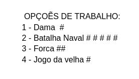
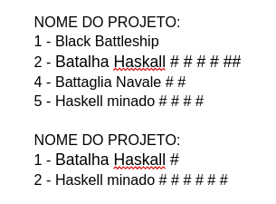
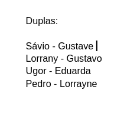

# Organização do Grupo

## Tema Do Jogo

O tema do Jogo implementado foi escolhido, assim como o nome do projeto, após uma listagem de possíveis temas relacionados ao tema, onde cada integrante do grupo foi capaz de escolher uma opção através de uma enquete feita no google documentos, assim como mostra a imagem abaixo. 

 
 

  

## Nome do Projeto

O nome do Projeto foi escolhido após uma listagem de possíveis nomes relacionados ao tema, onde cada integrante do grupo foi capaz de escolher uma opção através de uma enquete feita no google documentos, assim como mostra a imagem abaixo. 

 
 

  

## Organização de Commit 

Após a escolha do tema, devido a complexidade da linguagem para implementação do projeto, o grupo foi dividido em dupla para resolução de cada task definida durante a reunião do grupo.

  

## Ferramentas
Para a realização do projeto, foram utilizadas as seguintes ferramentas:

- Discord: Utilizado para realização de pareamento de duplas e reunião geral da equipe.
- WhatsApp: Utilizado para anotações, discursões rapidas e avisos da equipe. 
- Visual Studio Code: Utilizado para implementação do código-fonte do projeto. 

