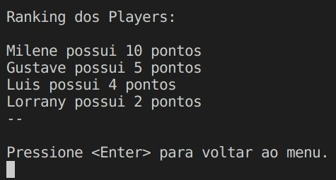

# Haskel_Minado

**Disciplina**: FGA0210 - PARADIGMAS DE PROGRAMAÇÃO - T01 <br>
**Nro do Grupo**: 03<br>
**Paradigma**: Funcional<br>

## Alunos

|Matrícula  |  Aluno |
| --------- | ------------------------------------------------------ |
| 170161897 | [Eduarda Servídio](https://github.com/ServidioEC)      | 
| 190046091 | [Gustave Augusto Persijn](https://github.com/gpersijn) |
| 170034992 | [Gustavo Afonso Pires](https://github.com/GustavoAPS)  |
| 180113992 | [Lorrany Oliveira](https://github.com/Lorranyoliveira) |
| 190032863 | [Lorrayne Alves](https://github.com/LorrayneCardozo)   |
| 190036435 | [Pedro Henrique Carvalho](https://github.com/peh099)   |
| 180130889 | [Sávio Cunha de Carvalho](https://github.com/savioc2)  |
| 170164357 | [Ugor Marcilio Brandão](ubrandao)                      |

## Sobre 

Pensando em colocar em prática os conhecimentos adquiridos em relação ao paradigma funcional, o presente projeto tem como inspiração um [projeto da disciplina apresentado no semestre passado](https://github.com/UnBParadigmas2022-1/2022.1_G4_Funcional_BatalhaNaval), porém trazendo diferenças e melhorias. Trata-se de um jogo conhecido como batalha naval, o qual deve ser jogado com dois jogadores que possui como objetivo principal afundar os navios do seu adversário, para isto ocorrer os jogadores devem encontrar esses navios por meio de coordenadas.

## Screenshots

1. A imagem abaixo apresenta o menu principal da aplicação.


2. A imagem abaixo apresenta um exemplo de visualização de ranking.



## Instalação 
**Linguagens**: Haskell<br>
**Tecnologias**: xxxxxx<br>
**Pré-requisito**: Possuir o GCHI
Descreva os pré-requisitos para rodar o seu projeto e os comandos necessários.
Insira um manual ou um script para auxiliar ainda mais.
Gifs animados e outras ilustrações são bem-vindos!

```
Para rodar o programa:
    
    1. Clone este repositório:
        git clone https://github.com/UnBParadigmas2022-2/2022.2_G3_Haskel_Minado.git
        
    2. Entre na pasta code:
        cd code

    3. Entre no Prelude, rodando a linha abaixo no terminal:
        ghci
    
    4. Depois de ter entrado no Prelude, rode o comando abaixo:
        :l teste.hs
    
    5. Por último, rode:
        *Main> main

```

## Uso 
Depois de seguido os passos acima, irá aparecer uma tela de menu principal em que antes de jogar, os jogadores primeiro deverão realizar o seu cadastro! Depois de cadastrado, poderão jogar e aproveitar!

## Vídeo
Adicione 1 ou mais vídeos com a execução do projeto.
Procure: 
(i) Introduzir o projeto;
(ii) Mostrar passo a passo o código, explicando-o, e deixando claro o que é de terceiros, e o que é contribuição real da equipe;
(iii) Apresentar particularidades do Paradigma, da Linguagem, e das Tecnologias, e
(iV) Apresentar lições aprendidas, contribuições, pendências, e ideias para trabalhos futuros.
OBS: TODOS DEVEM PARTICIPAR, CONFERINDO PONTOS DE VISTA.
TEMPO: +/- 15min

## Participações
Apresente, brevemente, como cada membro do grupo contribuiu para o projeto.
|Nome do Membro | Contribuição | Significância da Contribuição para o Projeto (Excelente/Boa/Regular/Ruim/Nula) |
| -- | -- | -- |
| Eduarda Servídio  | Ranking, leitura e escrita de arquivos (registro de jogadores), menu, alternar vez do jogador | Excelente |
| Gustave Augusto Persijn  |  Parse das strings de leitura, implementação da funcionalidade de poder escolher a posição inicial das embarcações | Excelente |
| Gustavo Afonso Pires  | Estruturação da lógica inicial e implementação do loop principal  | Excelente |
| Lorrany Oliveira  | Estruturação da lógica inicial e implementação do loop principal  | Excelente |
| Lorrayne Alves  | Ataque de uma posição (alterando o valor na matriz), Escolha da posição inicial das embarcações. | Excelente |
| Pedro Henrique Carvalho  | Ataque de uma posição (alterando o valor na matriz), Escolha da posição inicial das embarcações.  | Excelente |
| Sávio Cunha de Carvalho  | Organização da equipe e documentação  | Boa |
| Ugor Marcilio Brandão  | Ranking, leitura e escrita de arquivos (registro de jogadores), menu, alternar vez do jogador | Excelente |

## Outros 
Quaisquer outras informações sobre o projeto podem ser descritas aqui. Não esqueça, entretanto, de informar sobre:
(i) Lições Aprendidas;
(ii) Percepções;
(iii) Contribuições e Fragilidades, e
(iV) Trabalhos Futuros.

## Fontes
Referencie, adequadamente, as referências utilizadas.
Indique ainda sobre fontes de leitura complementares.
